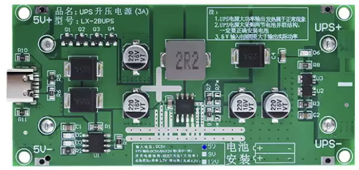
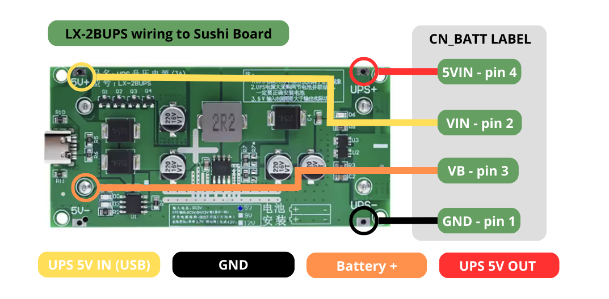

# <u>**LX-2BUPS UPS**</u>
  
  

**Description**  
LX-2BUPS DC-DC, USB-C, 15W 3A, 5V version. Holds 2x18650 lithium batteries.  

⚠️**Important**: For the LX-2BUPS module, the 18650 batteries must be the flat-top version.  

**Pinout**
* USB-C connector : 5V power IN
* UPS+/- : UPS 5V output
* 5V+/- : 5V power IN (same as USB-C)
* VB: 18650 battery +

**Software control**  
By ADC inputs from a microcontroller it's possible monitor the power source state (5V+ IN) and the battery level (VB).

**Sourcing**  
* [Google] : search "LX-2BUPS board".
