# **Sushi IoT Board v3.1**

# **Versions**

**Document version** : v1.0 [2025-11-29]  
**PCB version** : v3.1 (Kickster project)

## Contents
* [**Start and assembly guide**](#start-and-assembly-guide)
* [**Schematics and pinout**](#schematics-and-pinout)
* [**Kit contents list**](#kit-contents-list)
* [**Disclaimer**](#disclaimer)

# Start and assembly guide 

## <u>**Components overview**</u>

After opening the package, you can learn about the components in your kit by comparing them with the [**kit contents list**](#kit-contents-list)	

---
## <u>**Assembly**</u>

### **Soldering components**
If your kit is not the pre-assembled version, you need to solder some components. All are very simple, traditional components, so even if you're not very skilled at soldering, this step is manageable.
  
- Average time required for non-experts: 2h  
- What you need: a soldering kit. Even a basic, cheap model is sufficient.  

It's not mandatory, but the recommended steps to follow are:

1. **Solder all the add-on module headers/sockets**.  
In this picture, all add-on module headers and sockets are highlighted with different colors.  
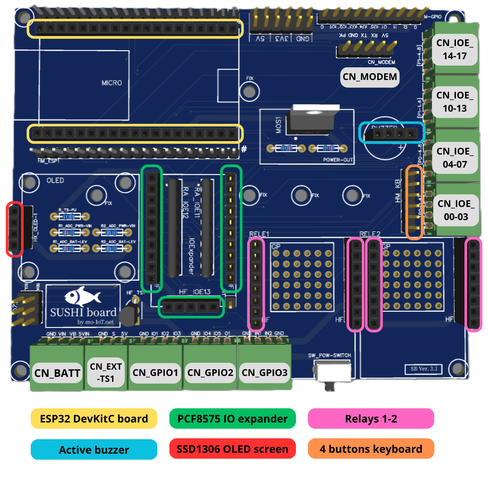

- **Solder all the components**  
Be careful with resistor values: they must match the values printed on the PCB. This may not be obvious to everyone — resistor values can be read using a tester or based on the colored lines on the component.  
⚠️ <u>Be careful when placing the IO-Expander resistor array</u> (blue color in the picture): the dot on the component must be on the same side as the dot on the PCB.

- **Solder the connectors on the main PCB**  
All connectors are marked in the picture with "CN_...".  

- **Solder UPS connection wires**  
If you're using a UPS battery to power the Sushi Board, you'll need to solder the 4 required wires.  
See the [LX-2BUPS wiring](#ups-battery) section and the CN_BATT connector in the UPS schematic diagram in the hardware guide.

- **Solder the module headers**  
Some modules, such as relays and IO expanders, are usually supplied without pre-soldered headers. In this case, solder them yourself. Note: all use 2.54 mm male headers.  
**Important note about the "PCF8575" IO Expander**: this module is often shipped with the front connector (the shorter one) bent. For Sushi Board installation, do not use this bent header — instead, use the straight one provided in the kit.

- **Solder the General Purpose connectors (OPTIONAL)**  
If you plan to use them, you can solder the extra GP connectors. Otherwise, you can leave them unmounted for now.  

---
### **Plug add-on modules**
Once soldering is complete, you can plug the add-on modules onto the board:

- Micro ESP32-DevKitC board: be careful to mount it on the correct side (USB connector to the right, as printed on the PCB)
- Buzzer: make sure to align the "+" pin correctly
- IO Expander module: cannot be inserted incorrectly
- Relay modules

If, for some reason, you're not using the top board:

- The OLED can be plugged directly into the base main board
- The keyboard must be plugged using the flat cable, left-aligned to pin 1 of the connector (see the [keyboard schematic diagram](#keyboard) for details)

---
### **Top PCB assembly**
The Top PCB is needed to set up the Sushi Board in "castle" configuration. This PCB doesn't contain any circuit traces — it's only used as mechanical support.  
All "fix kits" are listed in the [mounting hardware contents list](#mounting-hardware).

- Fix the OLED using the "OLED fix kit". Washers must be placed between the module and the top PCB
- Fix the UPS using the "Battery pack fix kit"
- Fix the MODEM using the "Modem fix kit"
- Attach the keyboard to the PCB by passing the flat cable through the slot in the PCB. Align the flat cable to pin 6 on the connector (see the [keyboard schematic diagram](#keyboard) for more details)
- Finally, fix the top PCB to the bottom using the "TOP PCB fix kit"

---
### **Assembly pictures**
Some pictures can be useful to highlight certain details and possibly answer some questions.

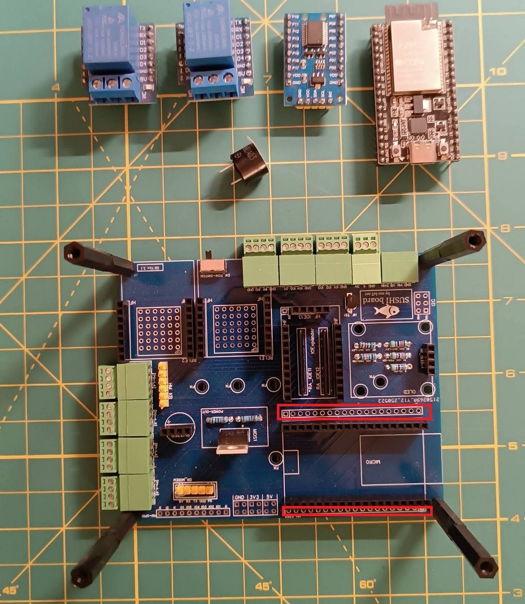  
PCB with essential components mounted. Note that the 2 sockets beside the ESP32 (highlighted in red) are mainly intended as test holes. The male header is not essential unless required for a custom application.  

---

  
Main PCB with all plug-in modules inserted into their sockets.  

---

  
Top view of the PCB with modem and UPS modules.  

---

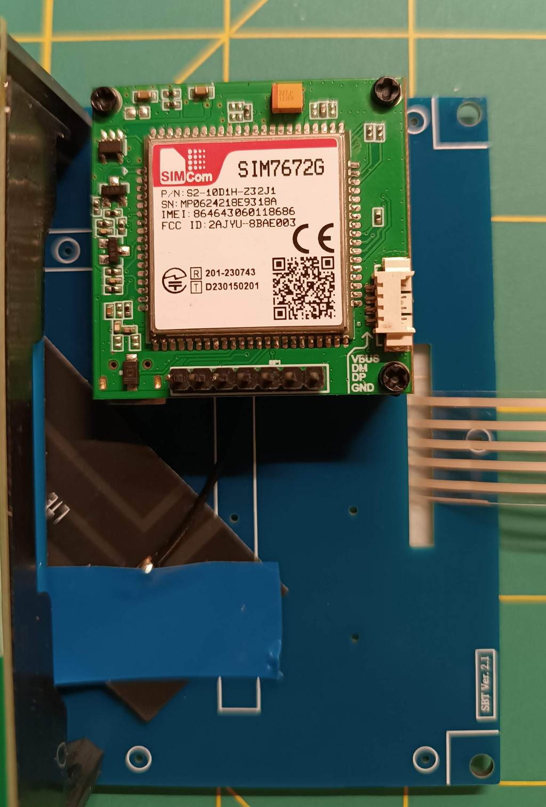  
Modem module view. The flexible 4G antenna can be fixed on the back of the PCB.  

---

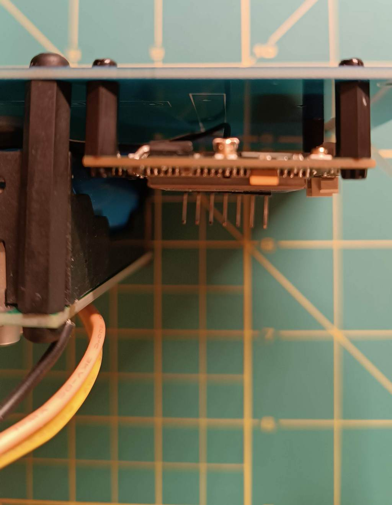  
Note that the modem uses only 3 spacers between the module and the top PCB. On the top PCB only 2 screws are used, while 3 screws are used to fix the spacers to the module. One spacer is “blind” on the top (no hole is required in the PCB).  

---

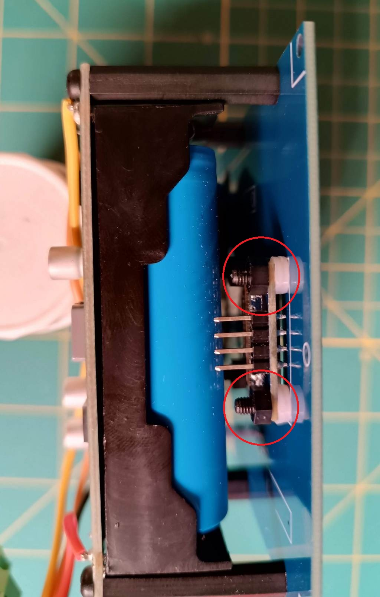  
Side view of UPS and OLED module mounting. Note that 2 spacing rings are used for each of the 4 fixing points.  

---

  
OLED connection between the main (bottom) and top PCBs.  

---

  
Keyboard connection view: when the keyboard is mounted on the top PCB, the connector must be aligned to the right (the unplugged pin on the left is highlighted in red). When the keyboard is placed on a desk, the connector must be aligned to the left. Don’t worry: an incorrect connection won’t cause damage; the keyboard will simply not work as expected.  

---

  
Side view with UPS connection.  

---

  
Modem module connection. Be very careful to plug the cable with the correct alignment indicated by the white dot. A wrong connection can damage the modem module!  

---
## <u>**First start**</u>

### **Connect the power supply**
There are different options to connect power to the board — see all available methods in the [CN_BATT diagram](#cn_batt).

---
### **System test**
The Sushi Board comes with the [Sushi-IoT-Framework](https://github.com/sushi-iot/sushi-iot-framework) preloaded. This allows for a quick system test at first startup.  
By browsing the user interface, you can perform a basic hardware check. For more details, see the [Sushi-IoT-Framework DOC](https://sushi-iot.github.io/sushi-iot-framework).

---
### **Setup & development**
At this stage, the Sushi Board is ready to use. You have two main options:

- Start using the [Sushi-IoT-Framework](https://github.com/sushi-iot/sushi-iot-framework), which gives you a ready-to-develop system using MicroPython. In this case, refer to the [Sushi-IoT-Framework DOC](https://sushi-iot.github.io/sushi-iot-framework).
- Develop and flash your own firmware using your preferred environment (Arduino, Espressif IDF, or others).

# Schematics and pinout

## <u>**Main PCB overview**</u>
<figure>

<figcaption>Main board view</figcaption>
</figure>

This is the main PCB where all components and add-on modules (except modem and battery UPS) are connected.

---
## **Top PCB overview**
<figure>

<figcaption>Top board view</figcaption>
</figure>

The top PCB does not include any circuit tracks; it serves only as a mechanical support for the screen, keyboard, battery, and modem. Using it is OPTIONAL, depending on your requirements.

---
## <u>**Connectors**</u>

---
### **CN_BATT**
Power connection

| Pin | Number | Description |
|---|---|---|
|GND|1|Power supply GND \* Normally connected to UPS Battery or external USB power supply (no battery)|
|VIN|2|Main power supply input \* Connected to micro ADC input to detect external power supply loss \* Range: 0-14V \* ESP32 function: I36|
|VB|3|Battery level detection \* Connected to micro ADC input to detect battery voltage level \* Range: 0-14V \* ESP32 function: IO34|
|5VIN|4|Main board 5V power supply \* Normally connected to UPS Battery output or external USB power supply (no battery) \* Range: 5V |

**Schematic diagram**
    

**IMPORTANT**: note that the SW_POW-SWITCH enable/disable any external power from *CN_BATT*.

**Power modes**    
There are different ways to power the Sushi board:

- **Powered by a direct 5V power supply**, without any external UPS or battery. In this case, connect:  
>CN_BATT pin 1 (GND label) to "-"  
CN_BATT pin 4 (5VIN label) to "+"  

Typically, the [USB-C Socket](#external-accessories--sensors) is used (RED wire is "+", BLACK wire is "-")  

- **Powered by the provided [UPS unit](#ups-battery)**.  
In this configuration, both external power presence and battery level can be monitored.  

- **Powered via the USB connector of the ESP32 DevKitC board**.  
This is the typical setup during software development, where the firmware is uploaded directly to the ESP32 board.  
⚠️ **TROUBLESHOOTING**: In this mode, when a MODEM is connected to *CN_MODEM*, the PC USB port may not supply enough current. As a result, the microcontroller may reset when the MODEM powers up. A possible solution is to keep the UPS unit connected (with the power switch on). In this way, the UPS battery will provide the extra current required, especially during boot.

- **Powered by an external custom battery or circuit**.  
In this case, the VIN and VB pins can still be used in a custom way to monitor external power and battery level. Be careful not to exceed the MAX input range of these pins. You can adapt the ADC voltage divider by changing resistor values to support a different input range. Note that 5VIN must always be a 5V power source coming from the external circuit.

---
### **CN_EXT-TS1** (temp. sensor)
Wired external DS18B20 temperature sensor

| Pin | Number | Description |
|---|---|---|
|GND|1|Ground wire|
|S|2|Signal wire|
|5V|3|Power supply wire|

**Schematic diagram**
    
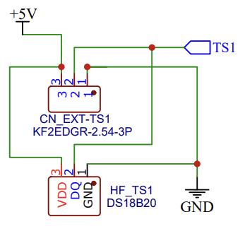

---
### **CN_GPIO1** (GPIO)
General-purpose I/O directly connected to the ESP32 microcontroller on the ESP32-DevKitC board.

| Pin | Number | Description |
|---|---|---|
|GND|1|Ground for GPIO|
|IO1|2|General-purpose Input/Output \* ESP32 function: IO19|
|IO2|3|General-purpose Input/Output \* ESP32 function: IO18|
|IO3|4|General-purpose Input/Output \* ESP32 function: IO5|

---
### **CN_GPIO2** (GPIO)
General-purpose I/O directly connected to the ESP32 microcontroller on the ESP32-DevKitC board.

| Pin | Number | Description |
|---|---|---|
|GND|1|Ground for GPIO|
|IO4|2|General-purpose Input/Output \* ESP32 function: IO4|
|IO5|3|General-purpose Input/Output \* ESP32 function: IO13|
|O1|4|General-purpose Output \* ESP32 function: IO2 \* This pin is used by the ESP32 during boot. For safety, use it as an output only (after boot, managed by firmware). If used as input, ensure no external signal forces it during boot as this may prevent the board from starting properly.|

---
### **CN_GPIO3** (GPIO)
General-purpose I/O directly connected to the ESP32 microcontroller on the ESP32-DevKitC board.

| Pin | Number | Description |
|---|---|---|
|GND|1|Ground for GPIO|
|IN1|2|General-purpose Input \* ESP32 function: I39 \* This pin is labeled "VN" on the DevKitC board|
|IN2|3|General-purpose Input \* ESP32 function: I35|
|GND|4|Ground for GPIO|

---
### **CN_IOE_00-03** (IO-exp)
Inputs connected to the PCF8575 I/O expander.  
By default, all inputs on CN_IOE_00-03 are used for the 4-button keyboard.  
If keyboard management is disabled, they can be used as general-purpose inputs.

| Pin | Number | Description |
|---|---|---|
|P0-1|1|Connected to Pin 00 on PCF8575 \* Default: keyboard|
|P0-2|2|Connected to Pin 01 on PCF8575 \* Default: keyboard|
|P0-3|3|Connected to Pin 02 on PCF8575 \* Default: keyboard|
|P0-4|4|Connected to Pin 03 on PCF8575 \* Default: keyboard|

---
### **CN_IOE_04-07** (IO-exp)
General-purpose inputs connected to the PCF8575 I/O expander.

| Pin | Number | Description |
|---|---|---|
|P0-5|1|Connected to Pin 04 on PCF8575|
|P0-6|2|Connected to Pin 05 on PCF8575|
|P0-7|3|Connected to Pin 06 on PCF8575|
|P0-8|4|Connected to Pin 07 on PCF8575|

---
### **CN_IOE_10-13** (IO-exp)
General-purpose inputs connected to the PCF8575 I/O expander.

| Pin | Number | Description |
|---|---|---|
|P1-1|1|Connected to Pin 10 on PCF8575|
|P1-2|2|Connected to Pin 11 on PCF8575|
|P1-3|3|Connected to Pin 12 on PCF8575|
|P1-4|4|Connected to Pin 13 on PCF8575|

---
### **CN_IOE_14-17** (IO-exp)
General-purpose inputs connected to the PCF8575 I/O expander.

| Pin | Number | Description |
|---|---|---|
|P1-5|1|Connected to Pin 14 on PCF8575|
|P1-6|2|Connected to Pin 15 on PCF8575|
|P1-7|3|Connected to Pin 16 on PCF8575|
|P1-8|4|Connected to Pin 17 on PCF8575|

**Schematic diagram**
    

---
### **CN_MODEM**
Modem connection. This interface can also be used for other devices or modules, depending on your application.

| Pin | Number | Description |
|---|---|---|
|PK|1|Modem "power key" pin (if required by the module) \* ESP32 function: IO32 \* Can also be used as GPIO|
|GND(MOS)|2|MOS-controlled GND, used to switch the modem on/off \* ESP32 function: IO23 (MOS gate) \* Can also control external device power|
|TX|3|Modem UART TX (micro RX) \* ESP32 function: IO26 \* Can also be used as GPIO|
|RX|4|Modem UART RX (micro TX) \* ESP32 function: IO27 \* Can also be used as GPIO|
|5V|5|5V power supply for modem|

**Schematic diagram**
    
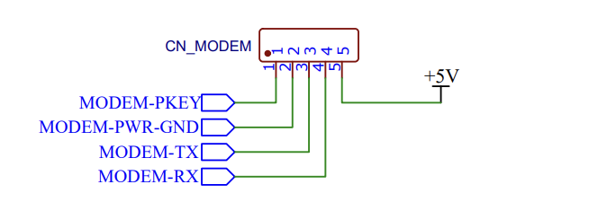  

---
## <u>**Add-on modules**</u>

---
### **Microcontroller board**
**Model:** ESP32 DevKitC v4, WROVER SoC - 4M Flash - 4M PSRAM - USB TYPE-C - PCB WiFi Antenna.

**Description**  
The ESP32 DevKitC board is the core of the Sushi Board and the only required module.  
It is a development board manufactured by Espressif, the ESP32 chip producer. Complete documentation is available here: [Espressif ESP32-DevKitC](https://docs.espressif.com/projects/esp-dev-kits/en/latest/esp32/esp32-devkitc/user_guide.html).  
**Any ESP32 DevKitC v4 board can be used, as they are all pin-compatible**.  
Note: If using a model with an external antenna connector, even if it has a visible PCB antenna, it may not be internally connected—so in that case, **you MUST use the external antenna** for proper WiFi operation.

**Software control**  
The ESP32 board can be programmed with several IDEs/languages, such as Espressif IDF (C/C++), Arduino (C/C++), and MicroPython.  
The board is preloaded with the [Sushi-IoT-Framework](https://github.com/sushi-iot/sushi-iot-framework), which handles core tasks and integrates MicroPython for custom development. For more details, see the [Sushi-IoT-Framework DOC](https://sushi-iot.github.io/sushi-iot-framework).

**Schematic diagram**
  
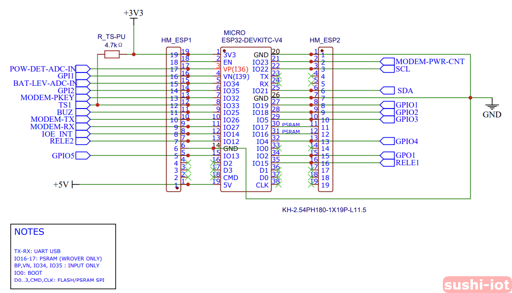

---
### **IO-Expander**
**Model:** PCF8575 IO-Expander module

**Description**
This module allows you to add an extra 16 GPIOs to the Sushi Board. It communicates via the I2C interface.

**Software control**
The PCF8575 IO-Expander is connected to the I2C data line on ESP32 pins IO22 and IO21.
If using the [Sushi-IoT-Framework](https://github.com/sushi-iot/sushi-iot-framework), the driver is integrated, and the IO-Expander can be managed by the MicroPython high-level API (see [Sushi-IoT-Framework DOC](https://sushi-iot.github.io/sushi-iot-framework)).

**Schematic diagram**

---
### **Screen**
**Model:** SSD1306

**Description**
0.96" 128x64 pixel I2C OLED module. It can be plugged directly onto the main Sushi PCB (bottom) or fixed on the top PCB support with the provided cable.

**Software control**
The SSD1306 OLED is connected to the I2C data line on ESP32 pins IO22 and IO21.
If using the [Sushi-IoT-Framework](https://github.com/sushi-iot/sushi-iot-framework), the driver is integrated, and the SSD1306 OLED can be managed by the MicroPython high-level API (see [Sushi-IoT-Framework DOC](https://sushi-iot.github.io/sushi-iot-framework)).

**Schematic diagram**

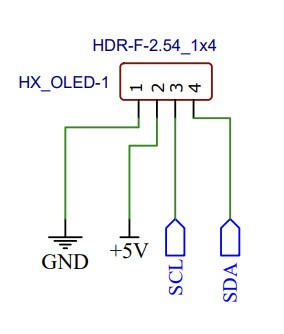

---
### **Keyboard**
**Model:** 4-button membrane keyboard

**Description**
It is connected to the Sushi Board via the I2C IO-Expander module.

**Software control**
The keypad is connected to the IO-Expander input on P0..P3.
If using the [Sushi-IoT-Framework](https://github.com/sushi-iot/sushi-iot-framework), keypad management is integrated and used to navigate the user menu. With the MicroPython high-level API, you can integrate your application-specific menu (see [Sushi-IoT-Framework DOC](https://sushi-iot.github.io/sushi-iot-framework)).

**Schematic diagram**

Note that the 4-button keyboard has a 5-pin flat cable:

- one is a common pin
- 4 pins corresponding to each button that connect to the common pin when a button is pressed

The keyboard connector has 6 pins with GND on both pins 1 and 6. This allows you to plug the keyboard on either side, without twisting the flat cable, by plugging the connector aligned to the left (if keyboard on the desk) or right (if keyboard on TOP PCB).

---
### **Relays**
**Model:** Wemos D1 mini relays

**Description**
Normally open contact 5A (250VAC/30VDC), 10A (125VAC), MAX: 1250VA/150W.
Normally closed contact 3A (250VAC/30VDC), MAX: 750VA/90W.
Relay output can be used to enable external devices, even with AC power. Module details: [Wemos D1 Mini](https://www.wemos.cc/en/latest/d1_mini_shield/relay.html).

**Software control**
Relays are connected directly to ESP32 pins IO12 and IO15. They can be managed by setting the pin as an output with an ON/OFF signal.

**Schematic diagram**

---
### **Buzzer**
**Model:** 3V Active Buzzer

**Description**
It can be directly controlled by a MicroPython GPIO pin. It can produce different sounds depending on the frequency and duty cycle of the signal used to control it. It is a general-purpose component and can be freely used depending on the application.

**Software control**
Connected directly to ESP32 pin IO25. It can be managed by setting the pin as an output with a PWM wave to modulate the frequency or simply with an ON/OFF signal.

**Schematic diagram**

---
### **Modem**
**Model:** SIMcom SIM7672X (NA,E,G) modem module.

**Description**
The modem is optional and is the only module fixed to the top support PCB, not on the main bottom PCB. This choice was made because there is no standard solution that can cover all possible needs. The SIMcom SIM7672X is a modem module with worldwide band support (NA=North America, E=Europe, G=Global) and certifications. Any SIM7672X can be compatible: [SIM7672X](https://en.simcom.com/product/SIM7672.html). Even any module with a UART interface can be interfaced with the Sushi Board (but may not be compatible with the [Sushi-IoT-Framework](https://github.com/sushi-iot/sushi-iot-framework) if you're using it).

**Software control**
The modem module is connected and controlled by the microcontroller through the connector [CN_MODEM](#cn_modem).
If using the [Sushi-IoT-Framework](https://github.com/sushi-iot/sushi-iot-framework), modem management for SIM7672X is integrated. With the MicroPython high-level API, you can perform common operations with the modem (see [Sushi-IoT-Framework DOC](https://sushi-iot.github.io/sushi-iot-framework)).

**Schematic diagram**

  

* To connect the antenna: follow the instruction in the figure.  
* To connect the modem to the board: use the provided cable.  
⚠️**Important**: to avoid damages be careful to plug the connector in the right side, with cable pin 1 (white dot on the connector) with the [CN_MODEM](#cn_modem) pin 1 (PK pin).  

---
### **UPS Battery**
**Model:** LX-2BUPS DC-DC, USB-C, 15W 3A, 5V version

**Description**
UPS unit, holds 2x18650 lithium batteries.  
⚠️**Important**: For the LX-2BUPS module, the 18650 batteries must be the flat-top version.

**Software control**
The UPS module is connected to the Sushi Board via the [CN_BATT](#cn_batt) connector. One ADC is connected to the main power supply IN to detect main power loss, while the second ADC is used to measure the battery level. ADC readings can be performed directly by managing the ADC pins or, if using the [Sushi-IoT-Framework](https://github.com/sushi-iot/sushi-iot-framework), with the MicroPython high-level API (see [Sushi-IoT-Framework DOC](https://sushi-iot.github.io/sushi-iot-framework)).

**Schematic diagram**

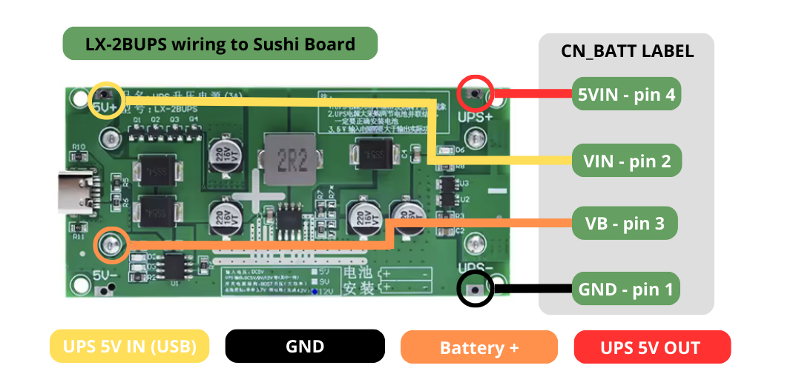
**Advice**: To reach *CN_BATT*, the RED and BLACK wires are about 7 cm long, while the YELLOW and ORANGE wires are about 16 cm long.

---
## <u>**Board components**</u>

---
## <u>**GP Optional Components**</u>
On the Sushi Board, there are several general-purpose (GP) elements that are all optional and can be used or not, depending on the specific application. All these elements can be omitted in a first step for basic use of the board.

# KIT contents list

## <u>**PCBs**</u>

| Name | Features | Picture | Quantity |
|---|---|---|---|
|Base PCB|Main PCB | | 1 |
|Top PCB|Optional top support PCB for "castle" mounting. Does not contain any circuit track.||1|

---
## <u>**Add-on modules**</u>

| Name | Features | Picture | Quantity |
|---|---|---|---|
**ESP32 DevKitC v4** | ESP32 microcontroller board: WROVER SoC - 4M Flash - 4M PSRAM - USB TYPE-C - PCB Wifi Antenna| |1|
Wifi antenna 2.4G | OPTIONAL external antenna necessary if a DevKitC v4 with an ESP32 SoC model using an external antenna plug is used| |1/0|
**SIMcom SIM7672X** | SIMcom SIM7672X (NA, E, G) modem module with adhesive antenna| |1 (kits with modem)|
Modem connection cable| Cable with connectors: Dupont header female 5P (Sushi Board side) -> Modem.| |1 (kits with modem)
**PCF8575**| PCF8575 IO-Expander module.| |1|
**LX-2BUPS DC-DC**|UPS battery: USB-C - 15W 3A - 5V version \* Includes 4x 20cm battery pack wires. \* 18650 batteries are not included. Important: For this UPS, 18650 batteries must be the flat-top version.| |1|
**SSD1306**|OLED screen||1|
Screen connection cable|Dupont cable male-female 4P 10cm to connect OLED on top PCB.| |1|
**4 buttons keypad**|4-button membrane keyboard| |1|
**Wemos D1 mini relays**|Relay output module| |2|
**Buzzer**|3V Active Buzzer| |1|

---
## <u>**Mounting hardware**</u>
| Name | Description | Picture | Quantity |
|---|---|---|---|
TOP PCB fix kit | \* 2x M3 6mm screws  \* 1x M3 30mm female-female hex spacer \* 1x M3 30mm female-male hex spacer||4|
OLED fix kit | To fix OLED on top PCB \* 1x M3 10mm screw \* 2x M3 1mm ring washers \* 1x M3 hex nut||4|
Battery pack fix kit | To fix battery pack on top PCB \* 2x M3 6mm screws \* 1x M3 30mm female-female hex spacer||4|
Modem fix kit | To fix modem on top PCB \* 2x M2 6mm screws \* 1x M2 10mm female-female hex spacer||4|
DIN Rail Adapter| OPTIONAL kit of 2 brackets to fix the board to a DIN rail||0|

---
## <u>Onboard components & connectors</u>
| Name | Description | Picture | Quantity |
|---|---|---|---|
KF2EDG 2.54 3P|Connector KF2EDG 2.54 3P, Curved needle||1
KF2EDG 2.54 4P|Connector KF2EDG 2.54 4P, Curved needle||8
Header male 2.54 1x40|Male header 2.54mm, 1 row, 40 pin||3
Header male 2.54 2x40|Male header 2.54mm, 2 rows, 40 pin||1
Header female 2.54 kit|Female socket header kit \* 2x 19-pin \* 4x 8-pin \* 2x 4-pin \* 1x 5-pin \* 2x 10-pin||1
IRLZ44NPBF| MOSFET for modem power supply control ||1|
A09-103 10K | Resistor array (8x 10K) for IO-Expander pull-up |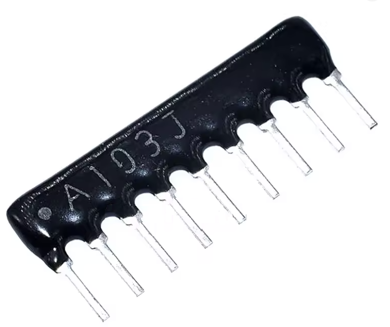|2
Power-in ADC divider|Power-in and battery ADC divider resistors \* 10K 1/4W \* 47K 1/4W Allows an input range of 0~14V max||2
DS18B20 pull-up resistor|Temperature sensor pull-up resistor 4.7K 1/4W. Required for DS18B20||1
MOSFET (modem power) resistors|Resistors for MOSFET to control modem power supply \* 10K 1/4W \* 20 1/4W||1
DS18B20 TO-92|Onboard temperature sensor||1|
SK-12D02 (VG3)|Onboard switch for power supply||1|

<!--XH 2.54|Altenative modem connector XH2.54 Straight needle, 5P|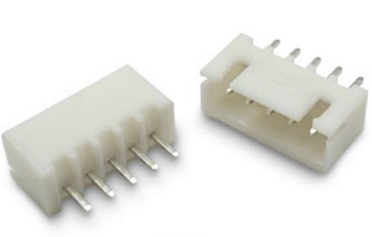|1-->

---
## <u>External accessories & sensors</u>
| Name | Description | Picture | Quantity |
|---|---|---|---|
Cabled DS18B20|Cabled external temperature sensor||1|
Panel LED|Waterproof IP67 Metal LED (green, 6mm, 3-6V)|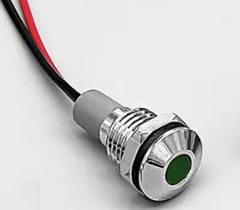|1|
Switch button with LED|OPTIONAL switch button with circular green light (LED). \* 12mm long \* Self-locking \* LED power: 3-9V \* Includes 4x wires for 12mm switch button||0|
USB-C Socket|USB-C 5A female socket, black. Useful for powering the Sushi Board when a UPS battery is not used or when installing in a plastic case||1|

# **Disclaimer**
This product is intended for educational, hobbyist, and prototyping purposes only.
It is not a certified end-user product and is not suitable for industrial, commercial, or medical applications.
The manufacturer and distributors assume no responsibility for any damage, injury, or loss resulting from the use, misuse, or improper handling of this product.
This product is provided "as is" without warranty of any kind, either expressed or implied, including but not limited to warranties of merchantability, fitness for a particular purpose, or non-infringement.

This is not a toy and not intended for children under 14 years of age.
It is classified as a development tool / unfinished electronic assembly, not subject to CE or FCC certification as a finished consumer device.
Use at your own risk.