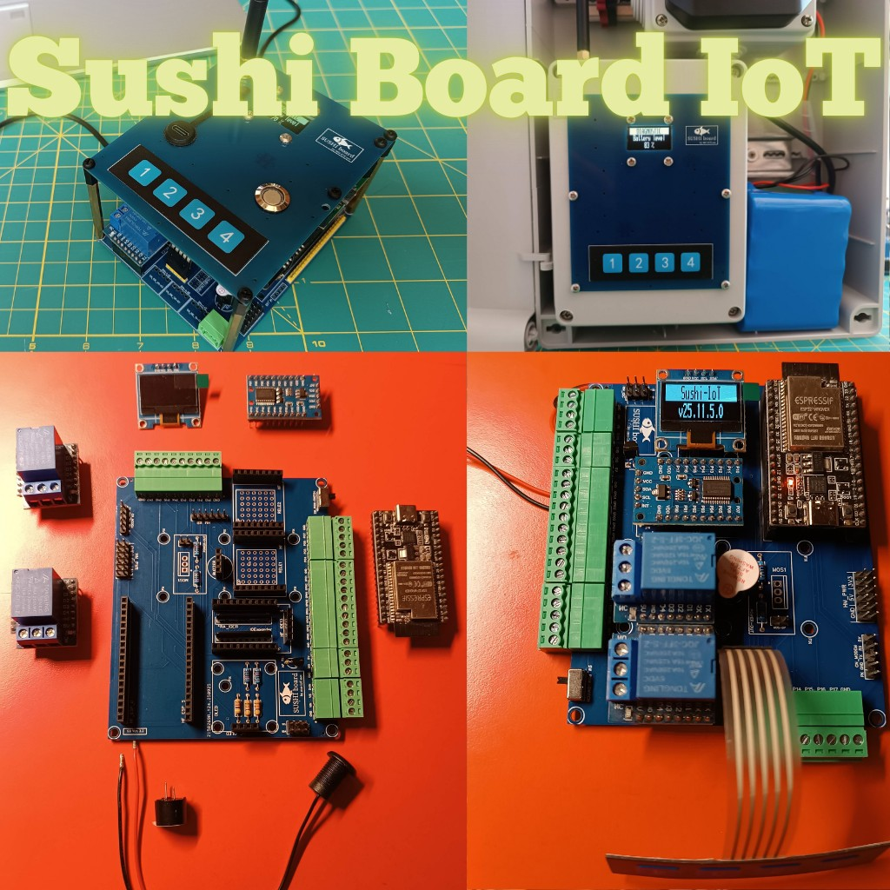
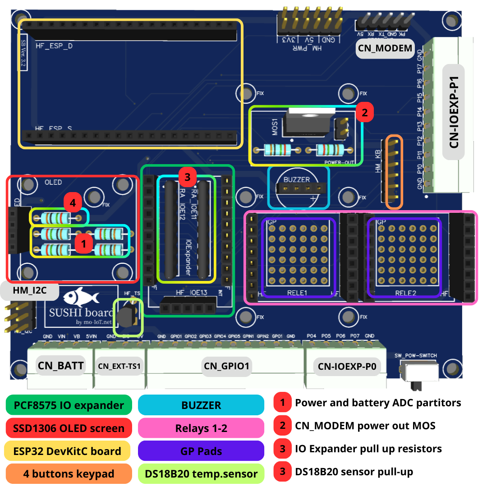

# **Sushi IoT Board v3.2**

# **Versions**

**Document version** : v1.0 [2025-12-01]  
**PCB version** : v3.2

# **Contents**

* [**Overview**](#overview)
* [**Components and modules**](#components-and-modules)
* [**Pinout**](#pinout)
* [**Schematics**](#schematics)
* [**Instructions**](#instructions)

# **Overview**

**Sushi Board is an ESP32-based programmable modular embedded system for general-purpose IoT, suitable for STEM education and DIY electronics projects.**

Based on widely available commercial modules, connect the essential components needed to create an IoT unit, suitable for various applications.

## **Hardware features**

* ESP32-DevKitC V4
* 16x digital GPIN 
* 2x Relay OUT (10A 250V AC)
* 5x digital direct GPIO, 1 x GPO , 2 x GPI (LEDs, extra UART, etc.) 
* Physical keyboard
* OLED Display 
* Connectivity: Wi-Fi, Bluetooth, modem 2G/3G/4G, UART, I2C
* Power supply modes: 5V (USB adapter or wired) ; Battery only ; 5V + backup battery (for when grid power is missing)
* Backup battery
* Power status and battery level acquisition 
* Buzzer for audio alerts
* Temperature sensor
* Size: 90x110 mm (both carrier and TOP boards)

# **Components and modules**

## **Add-on modules**

| Name | Description | Picture |
|---|---|---|
[**ESP32DevKitC(v4)**](../../modules/ESP32DevKitC-WROVER.md) | Official Espressif ESP32 microcontroller dev board| |
[**SSD1306**](../../modules/OLED_SSD1306.md)|I2C 0.96" OLED screen||
[**PCF8575**](../../modules/IOE-PCF8575.md)| PCF8575 I2C IO-Expander module.| |
[**4 buttons keypad**](../../modules/keypad_4k.md)|4-button membrane keyboard| |
[**Wemos D1 mini relays**](../../modules/relay_d1_mini.md)|Relay output module. Can be mounted 2x of this modules.| |
[**Buzzer**](../../modules/buzzer.md)|3V Active Buzzer| |

## **External components and modules**
| Name | Description | Picture |
|---|---|---|
[**Cabled DS18B20**](../../modules/TS_DS18B20.md)|Cabled external temperature sensor||
[**SIMcom SIM7672X**](../../modules/MODEM_SIM7672X.md) | SIMcom SIM7672X (NA, E, G) modem module with adhesive antenna||
[**LX-2BUPS DC-DC**](../../modules/UPS_LX-2BUPS.md)|UPS unit USB-C 5V 3A||

## **Useful accessories**
| Name | Description | Picture |
|---|---|---|
USB-C power socket|Useful to power the board directly from any USB power supplier||

# **Pinout**

## **CN_BATT** (power)
Power connection

| Pin | Number | Description |
|---|---|---|
|GND|1|Power supply GND|
|VIN|2|Main power supply detect input \* Connected to micro ADC input to detect external power supply state (if have battery) \* Range: 0-14V \* ESP32 pin: ADC on I36|
|VB|3|Battery level detection \* Connected to micro ADC input to detect battery voltage level \* Range: 0-14V \* ESP32 pin: ADC on IO34|
|5VIN|4|Main board 5V power supply \* Normally connected to UPS Battery output or external USB power supply (if have no battery) \* Range: 5V |

⚠️The SW_POW-SWITCH enable/disable 5VIN from *CN_BATT*.

**Power modes**    
There are different ways to power the Sushi board:

- **Power by a direct 5V power supply**, without any external UPS or battery. In this case, connect:  
  >CN_BATT pin 1 (GND label) to "-"  
  CN_BATT pin 4 (5VIN label) to "+"  
  
  ℹ️ An USB-C power socket can be useful to power the board in this way.  
  

- **Power by an UPS unit like [LX-2BUPS](../../modules/UPS_LX-2BUPS.md)**.  
In this configuration, both external power presence and battery level can be monitored.   
  
  ℹ️ To reach *CN_BATT*, the RED and BLACK wires are about 7 cm long, while the YELLOW and ORANGE wires are about 16 cm long.  

- **Power via the USB connector of the ESP32 DevKitC board**.  
This is the typical setup during software development, where the firmware is uploaded directly to the ESP32 board.  
⚠️ **TROUBLESHOOTING**: In this mode, when a MODEM is connected to *CN_MODEM*, the PC USB port may not supply enough current. As a result, the microcontroller may reset when the MODEM powers up. A possible solution is to keep the UPS unit connected (with the power switch on). In this way, the UPS battery will provide the extra current required, especially during boot.

- **Power by an external custom battery or circuit**.  
In this case, the VIN and VB pins can still be used in a custom way to monitor external power and battery level. Be careful not to exceed the MAX input range of these pins. The ADC voltage divider can adapted by changing resistor values to support a different input range. Note that 5VIN must always be a 5V power source coming from the external circuit.

## **CN_EXT-TS1** (temperature sensor)
Wired external cabled [**DS18B20 temperature sensor**](../../modules/TS_DS18B20.md).

| Pin | Number | Description |
|---|---|---|
|GND|1|Ground wire|
|S|2|Signal wire|
|5V|3|Power supply wire|

## **CN_GPIO1** (GPIO)
General-purpose I/O directly connected to the ESP32 microcontroller on the ESP32-DevKitC board.

| Pin | Number | Description |
|---|---|---|
|GND|1|Ground for GPIO|
|GPIO1|2|General-purpose Input/Output \* ESP32 pin: IO19|
|GPIO2|3|General-purpose Input/Output \* ESP32 pin: IO18|
|GPIO3|4|General-purpose Input/Output \* ESP32 pin: IO5|
|GPIO4|5|General-purpose Input/Output \* ESP32 pin: IO4|
|GPIO5|6|General-purpose Input/Output \* ESP32 pin: IO13|
|GPI1|7|General-purpose Input \* ESP32 pin: I39|
|GPI2|8|General-purpose Input \* ESP32 pin: I35|
|GPO1|9|General-purpose Output \* ESP32 pin: IO2 \* ⚠️This pin is used by the ESP32 during boot. For safety, use it as an output only (after boot, managed by firmware). If used as input, ensure no external signal forces it during boot as this may prevent the board from starting properly.|
|GND|10|Ground for GPIO|

## **CN-IOEXP-P0** (IO-expander P0)
General-purpose inputs connected to the [**PCF8575**](../../modules/IOE-PCF8575.md) I/O expander.

| Pin | Number | Description |
|---|---|---|
|P04|1|Connected to P04 on PCF8575|
|P05|2|Connected to P05 on PCF8575|
|P06|3|Connected to P06 on PCF8575|
|P07|4|Connected to P07 on PCF8575|
|GND|4|Ground|

## **CN-IOEXP-P1** (IO-expander P1)
General-purpose inputs connected to the [**PCF8575**](../../modules/IOE-PCF8575.md) I/O expander.

| Pin | Number | Description |
|---|---|---|
|GND|1|Ground|
|P10|2|Connected to P10 on PCF8575|
|P11|3|Connected to P11 on PCF8575|
|P12|4|Connected to P12 on PCF8575|
|P13|5|Connected to P13 on PCF8575|
|P14|6|Connected to P14 on PCF8575|
|P15|7|Connected to P15 on PCF8575|
|P16|8|Connected to P16 on PCF8575|
|P17|9|Connected to P17 on PCF8575|
|GND|10|Ground|

## **CN_MODEM** (modem)
Connection to modem like [**SIMcom SIM7672X**](../../modules/MODEM_SIM7672X.md).  
This interface depending on application can also be used for other GP devices or modules.  

The modem module is connected and controlled by the microcontroller by the UART interface with AT commands.
Any module with a UART interface can be connected to Sushi Board by CN_MODEM.  

| Pin | Number | Description |
|---|---|---|
|PK|1|Modem "power key" pin (if required by the module) \* ESP32 pin: IO32 \* Can also be used as GPIO|
|GND(MOS)|2|MOS-controlled GND, used to switch the modem on/off \* ESP32 pin: IO23 (MOS gate) \* Can also control external device power \* ℹ️ **MOS-BP** jumper let close the contact without control/mount the MOS|
|TX|3|Modem UART TX (micro RX) \* ESP32 pin: IO26 \* Can also be used as GPIO|
|RX|4|Modem UART RX (micro TX) \* ESP32 pin: IO27 \* Can also be used as GPIO|
|5V|5|5V power supply for modem|

⚠️ To connect the modem module through the CN_MODEM header, you can use a 5-wire Dupont cable and reorder the pins to match the correct signal positions. However, to avoid issues related to noise and power stability, it is recommended:
* twist the wires
* use Dupont cables with a maximum length of 10 cm and AWG24 wire size

ℹ️ If using  [Sushi-IoT-Framework](https://github.com/sushi-iot/sushi-iot-framework), the base modem model that is supported is [**SIMcom SIM7672X**](../../modules/MODEM_SIM7672X.md), that guarantee world wide network support.
Others modules could be supported in the future, check the compatibility list in the software DOC.

## **HM_I2C** (I2C BUS)
I2C BUS connection to connect other external I2C devices. 
Onboard connected to I2C BUS there is:
* OLED display 
* IO-Expander, that use and extra signal to manage interrupts (connected to ESP32 IO14 pin).

| Pin | Number | Description |
|---|---|---|
|SCL|1,3,5|I2C SCL signal \* ESP32 pin: IO22|
|SDA|2,4,6|I2C SDA signal \* ESP32 pin: IO21|

## **HM_KB** (keypad)
Keypad connection to IO-Expander inputs.

ℹ️ this connector is done for a [4-button keyboard](../../modules/keypad_4k.md) that has a 5-pin flat cable.
The keyboard **HM_KB** connector has 6 pins with GND on both pins 1 and 6. This allows plug the keyboard on either side, without twisting the flat cable, by plugging the connector aligned to the left (if keyboard on the desk) or right (if keyboard on TOP PCB).

| Pin | Number | Description |
|---|---|---|
|GND|1|Common GND|
|B1|2|Button 1 \* ESP32 pin: IO-expander P00|
|B2|3|Button 2 \* ESP32 pin: IO-expander P01|
|B3|4|Button 3 \* ESP32 pin: IO-expander P02|
|B4|5|Button 4 \* ESP32 pin: IO-expander P03|
|GND|6|Common GND|

## **HF_RELE21-11** (relays 1-2)
On the board can be plugged 2x [**Wemos D1-mini relays**](../../modules/relay_d1_mini.md).  
The relay output can be used to enable external devices, even with AC power.  
ℹ️ on the PCB the relay 1-2 sockets are marked as RELE1-2.

| Pin | Number | Description |
|---|---|---|
|5V|1|5V VCC|
|GND|2|GND|
|D4|3|Not connected|
|D3|4|Not connected|
|D2|5|Not connected|
|D1|6|Enable contact \* ESP32 pin:IO12 (relay 1) , IO15 (relay 2)|
|RX|7|Not connected|
|TX|8|Not connected|

ℹ️ The pin name in the table are referred as marked on D1-mini board.

## **HF_BUZZER** (buzzer)
2 pin female header to plug an active [**buzzer**](../../modules/buzzer.md).

| Pin | Number | Description |
|---|---|---|
|GND|1|Buzzer -|
|NC|2|Not connected|
|NC|3|Not connected|
|+|4|Buzzer + \* ESP32 pin: IO25|

# **Schematics**

[Sushi Board 3.2 Schematics](img/sb-3.2-schematics.pdf)

# **Instructions**

## **Assembling from PCBA**

**PCBA** is the base PCB with all components, connectors, and sockets already mounted.  

From a Sushi Board PCBA, it is quite straightforward to mount the add-on modules.  
In the [**Components and modules table**](#components-and-modules), each item includes a link to a brief page with useful information for sourcing, usage, and mounting.

Additional useful information can be found in the [**pinout section**](#pinout), which describes the connectors available on the board.

## **First start**

### **Connect the power supply**
There are different options to connect power to the board — see all available methods in the [CN_BATT diagram](#cn_batt-power).

### **System test**
It's possible perform a complete test of Sushi Board loading [Sushi-IoT-Framework](https://github.com/sushi-iot/sushi-iot-framework).
By browsing the user interface, it's possible perform a basic hardware check.

### **Setup & development**
When Sushi Board is ready to use, there are two main options:

* Start using the [Sushi-IoT-Framework](https://github.com/sushi-iot/sushi-iot-framework), which gives you a ready-to-develop system using MicroPython.
* Develop and flash your own firmware using your preferred environment (Arduino, Espressif IDF, or others).

## **Disclaimer**
This board is intended for educational, hobbyist, and prototyping purposes only.
It is not a certified end-user product and is not suitable for industrial, commercial, or medical applications.
The manufacturer and distributors assume no responsibility for any damage, injury, or loss resulting from the use, misuse, or improper handling of this product.
This board is provided "as is" without warranty of any kind, either expressed or implied, including but not limited to warranties of merchantability, fitness for a particular purpose, or non-infringement.

This is not a toy and not intended for children under 14 years of age.
It is classified as a development tool / unfinished electronic assembly, not subject to CE or FCC certification as a finished consumer device.
Use at your own risk.

## **Other resources**

* [Examples & projects](https://github.com/sushi-iot/sushi-iot-framework/tree/main/examples)
* [Sushi-IoT on Instagram](https://www.instagram.com/sushi_board_iot/)
* [Sushi-IoT on HACKADAY](https://hackaday.io/project/204489-sushi-iot-framework)
* [Sushi IoT Framework](https://sushi-iot.github.io/sushi-iot-framework/)
* [Sushi Board overview](https://sushi-iot.github.io/sushi-iot-board/)